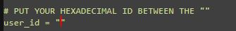

# -How-to-use-Apollo-Save-Tool-AIO-Fake-account-for-Chaiki-
 How to use Apollo Save Tool AIO + Fake account for Chaiki 

# Fake account creation for Chiaki and misc       
1. Download and install [Apollo Save Tool](https://pkg-zone.com/details/APOL00004) to your PS4 guide on how here >[How to install FPKGS](https://github.com/DrYenyen/How-To-Install-PS4-FPKGS)         
2. Download and unpack/install chiaki for the platform you want > https://git.sr.ht/~thestr4ng3r/chiaki/refs/v2.2.0   
3. Launch Apollo Save Tool then navigate to option 5 from left to righ **User Tools**    
4. Select **Activate PS4 Accounts**    
5. Select the account you want to activate and press **X**         
6. A string of letters and numbers will show up copy them **CORRECTLY** then press **R2** then **X** and then keep pressing **O** till you are asked if you want to exit to the XMB accept then restart the console            
(the string can be found in **About** in Apollo Save Tool incase you lose it)              
7. Download the **main.py** from here > [main.py](https://github.com/DrYenyen/-How-to-use-Apollo-Save-Tool-AIO-and-Fake-account-for-Chaiki-/releases/download/new/main.py)   or copy and paste the code below into a website that is able to run python scripts         
```    
import base64


# PUT YOUR HEXADECIMAL ID BETWEEN THE ""
user_id = "" 

if len(user_id):
  user_id_int = int( user_id, 16 )
  user_id_base64 = base64.b64encode(user_id_int.to_bytes(8, "little")).decode()
  print( "Your 8 bytes, base64 encoded account ID is : " + str(user_id_base64))
else:
  print("Change the content of 'user_id' to match the string you found in Apollo.")
```  
8. Websites it can run on or is already loaded on        
copy and paste into > https://www.online-python.com/     
copy and paste into > https://www.programiz.com/python-programming/online-compiler/   
Already loaded here > https://trinket.io/embed/python3/ba2ff26973   
9. Alternatively run on your own PC offline     
10. Once you are ready to run the code paste the string of letters and numbers you copied earlier where the red line is shown below and run the scrip        
      
11. Copy the new string of numbers and letters it should end with ''=''    
12. You can now open Chiaki and paste it in the **PSN Account-ID (base64):** field along with the pin you are getting from the remote play menu.        
13. Enjoy!     
